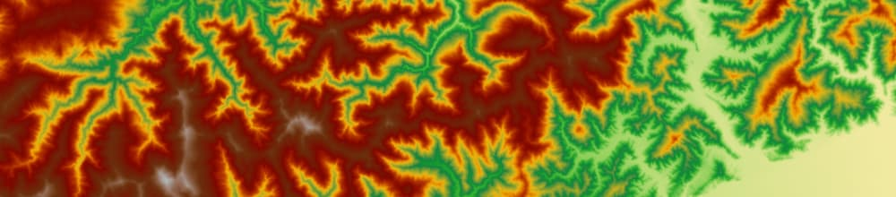
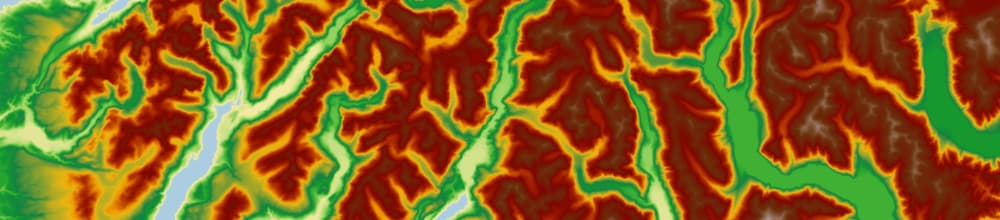
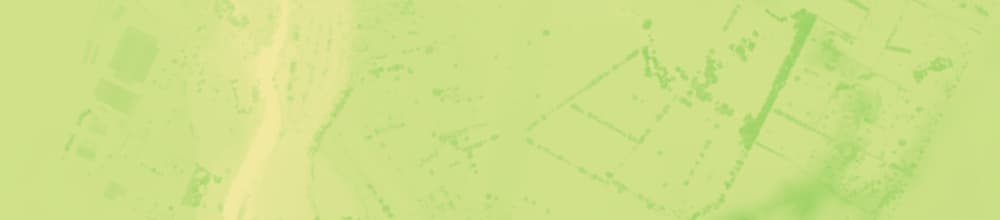
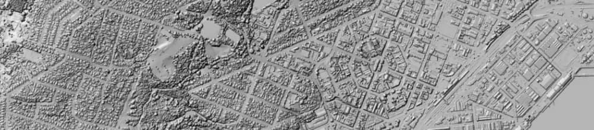
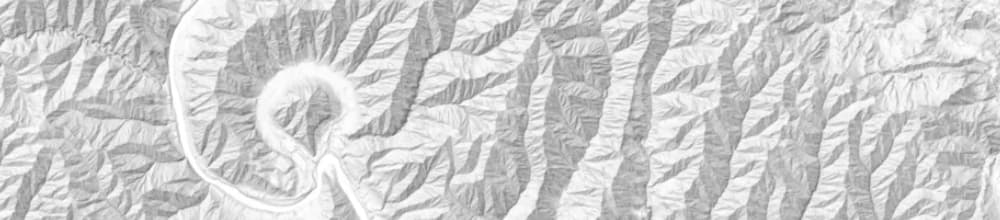

# New Zealand Elevation

[](https://registry.opendata.aws/nz-elevation/)
[](https://radiantearth.github.io/stac-browser/#/external/nz-elevation.s3-ap-southeast-2.amazonaws.com/catalog.json?.language=en)
[](https://developmentseed.org/stac-map/?href=https://nz-elevation.s3.ap-southeast-2.amazonaws.com/catalog.json)

Toitū Te Whenua makes New Zealand's most up-to-date publicly owned elevation data freely available to use under an open licence. You can access this through the [LINZ Data Service](https://data.linz.govt.nz/data/category/elevation/), [LINZ Basemaps](https://basemaps.linz.govt.nz/@-41.8899962,174.0492437,z5?i=elevation) or the [Registry of Open Data on AWS](https://registry.opendata.aws/nz-elevation/).

This repository contains STAC Collection metadata for each elevation dataset, as well as some guidance documentation.

## Quickstart

Browse the archive with [STAC Browser](https://radiantearth.github.io/stac-browser/#/external/nz-elevation.s3-ap-southeast-2.amazonaws.com/catalog.json?.language=en) or access the catalog directly [https://nz-elevation.s3-ap-southeast-2.amazonaws.com/catalog.json](https://nz-elevation.s3-ap-southeast-2.amazonaws.com/catalog.json)

## Data Access

Toitū Te Whenua owns and maintains a public bucket which is sponsored and shared via the [Registry of Open Data on AWS](https://registry.opendata.aws/nz-elevation/) `s3://nz-elevation` in `ap-southeast-2`.

Using the [AWS CLI](https://aws.amazon.com/cli/) anyone can access all of the imagery specified in this repository.

```
aws s3 ls --no-sign-request s3://nz-elevation/
```

For more information on interacting with the metadata and data in `s3://nz-elevation`, see further guidance:

- [Usage](docs/usage.md) shows how TIFFs can be interacted with from S3 using GDAL, QGIS, etc
- [TIFF Specification](docs/tiff-specification.md) provides technical details on how our TIFFs are created using GDAL
- [Elevation Compression](docs/research/tiff-compression.md) provides commentary and analysis on the compression options we explored

## Data Overview

The `s3://nz-elevation` bucket comprises of a variety of different elevation data types, created for different purposes. [Naming](docs/naming.md) covers the `s3://nz-elevation` bucket structure.

### 1m Digital Elevation Models

Digital Elevation Models are a representation of the bare ground topographic surface devoid of buildings, vegetation, towers and other surface objects. They are procured according to the [National Aerial LiDAR Base Specification](https://www.linz.govt.nz/resources/guide/new-zealand-national-aerial-lidar-base-specification).

     
   Example: **New Zealand LiDAR 1m DEM** | [STAC Collection](https://nz-elevation.s3-ap-southeast-2.amazonaws.com/new-zealand/new-zealand/dem_1m/2193/collection.json) | [LINZ Basemaps](https://basemaps.linz.govt.nz/@-41.2942307,173.9921924,z9.62?i=elevation&pipeline=terrain-rgb&format=png) | [LINZ Data Service](https://data.linz.govt.nz/layer/121859-new-zealand-lidar-1m-dem/)

### Contour-Interpolated 8m Digital Elevation Model

The Contour-Interpolated DEM has been created and interpolated from the contours in the Topo50 map series. LiDAR-derived DEMs are now available for 90% of the New Zealand mainland and are significantly more accurate. This dataset is suitable for cartographic visualisation only, not for terrain analysis.

     
   Example: **New Zealand Contour-Interpolated 8m DEM** | [STAC Collection](https://nz-elevation.s3-ap-southeast-2.amazonaws.com/new-zealand/new-zealand-contour/dem_8m/2193/collection.json) | *Not currently published on LINZ Basemaps* | [LINZ Data Service](https://data.linz.govt.nz/layer/51768-nz-8m-digital-elevation-model-2012/)

### 1m Digital Surface Models

Digital Surface Models are a representation of the highest objects on Earth's surface including buildings, vegetation, towers and other surface objects. They are also procured according to the [National Aerial LiDAR Base Specification](https://www.linz.govt.nz/resources/guide/new-zealand-national-aerial-lidar-base-specification).

     
   Example: **New Zealand LiDAR 1m DSM** | [STAC Collection](https://nz-elevation.s3-ap-southeast-2.amazonaws.com/new-zealand/new-zealand/dsm_1m/2193/collection.json) | [LINZ Basemaps](https://basemaps.linz.govt.nz/@-37.7720691,175.2980036,z12.76?i=elevation-dsm&pipeline=terrain-rgb&format=png) | [LINZ Data Service](https://data.linz.govt.nz/layer/122082-new-zealand-lidar-1m-dsm/)

### Hillshade

Hillshades are a representation of terrain generated from elevation data that models a lighting effect on the landscape to mimic how sunlight creates shadows and highlights. New Zealand-wide datasets are available for both the DEMs and DSMs, using standard and "Igor" methods.

     
   Example: **New Zealand DSM Hillshade** | [STAC Collection](https://nz-elevation.s3-ap-southeast-2.amazonaws.com/new-zealand/new-zealand/dsm-hillshade/2193/collection.json) | [LINZ Basemaps](https://basemaps.linz.govt.nz/@-45.8750001,170.5104042,z14.52?i=hillshade-dsm) | [LINZ Data Service](https://data.linz.govt.nz/layer/122138-new-zealand-dsm-hillshade/)

### Hillshade - Igor

The "Igor" hillshade method is an alternative hillshade representation that renders a softer hillshade for general mapping purposes. It is named after its creator - Igor Breki.

     
   Example: **New Zealand DEM Hillshade - Igor** | [STAC Collection](https://nz-elevation.s3-ap-southeast-2.amazonaws.com/new-zealand/new-zealand/dem-hillshade-igor/2193/collection.json) | [LINZ Basemaps](https://basemaps.linz.govt.nz/@-39.7179024,175.1907307,z11.99?i=hillshade-igor) | [LINZ Data Service](https://data.linz.govt.nz/layer/121958-new-zealand-dem-hillshade-igor/)

## Related

- For access to LINZ's aerial and satellite imagery see [linz/imagery](https://github.com/linz/imagery)
- For access to LINZ's coastal elevation data see [linz/coastal](https://github.com/linz/coastal/)

## Licence

Source code is licensed under [MIT](LICENSE).

All metadata and docs are licensed under [CC-BY-4.0](https://creativecommons.org/licenses/by/4.0/).

For [more information on elevation attribution](https://www.linz.govt.nz/products-services/data/licensing-and-using-data/attributing-elevation-or-aerial-imagery-data).
