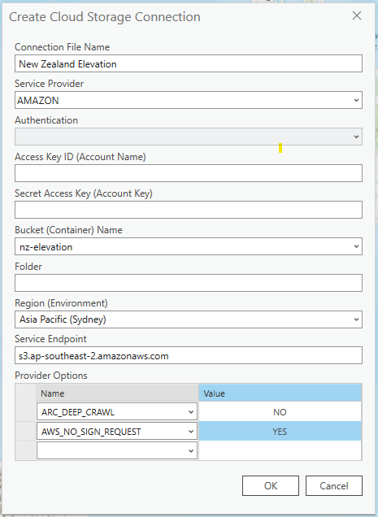
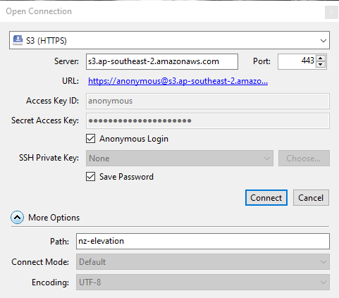

# Usage

Our public New Zealand Elevation bucket can be used with a number of applications, including [s5cmd](#s5cmd), [GDAL](#gdal), [QGIS](#qgis), [ArcGIS Pro](#arcgis-pro) and [Cyberduck](#cyberduck).

## Get the link to the TIFF

The STAC Catalog, https://nz-elevation.s3-ap-southeast-2.amazonaws.com/catalog.json, is the entry point of the LINZ elevation data. It points to the different STAC Collections representing a dataset.

> **_Note:_** The files in the _nz-elevation_ bucket can be accessed via `s3://nz-elevation` or `https://nz-elevation.s3-ap-southeast-2.amazonaws.com/`.

### Manually navigate through the STAC Catalog to a get a TIFF

This is an example using the "Taranaki LiDAR 1m DEM (2021)" dataset.

1. From `catalog.json` get the Collection link for "Taranaki LiDAR 1m DEM (2021)" in the `links` list:

   ```json
   {
   "rel": "child",
   "href": "./taranaki/taranaki_2021/dem_1m/2193/collection.json",
   "title": "Taranaki LiDAR 1m DEM (2021)",
   "file:checksum": "122098144561ea4de8e880fb3b857b1ca07d32400189cf48cf9cad96921efdeb3f15",
   "file:size": 25426
   },
   ```

2. The Collection can be accessed from this GitHub repository, `stac/taranaki/taranaki_2021/dem_1m/2193/collection.json` or from `https://nz-elevation.s3-ap-southeast-2.amazonaws.com/taranaki/taranaki_2021/dem_1m/2193/collection.json`. From the Collection get an Item link in the `links` list:

   ```json
   { "rel": "item", "href": "./BH31_10000_0403.json", "type": "application/json" }
   ```

3. The Item can be accessed from `https://nz-elevation.s3-ap-southeast-2.amazonaws.com/taranaki/taranaki_2021/dem_1m/2193/BH31_10000_0403.json`. A list of assets can be found:

   ```json
   "assets": {
     "visual": {
       "href": "./BH31_10000_0403.tiff",
       "type": "image/tiff; application=geotiff; profile=cloud-optimized",
       "file:checksum": "122042af9034edaf0c2ff7522e26db4fb3a4a5835015f6dfc118acbd6c3f2b011ee5"
     }
   }
   ```

4. In this case, the TIFF can be accessed from `https://nz-elevation.s3-ap-southeast-2.amazonaws.com/taranaki/taranaki_2021/dem_1m/2193/BH31_10000_0403.tiff`

> **_Note:_** Our TIFF files and STAC Item files use the same base name. Having the link to the STAC Item, you can determine the TIFF link by changing its suffix from `.json` to `.tiff`.

## s5cmd

[s5cmd](https://github.com/peak/s5cmd) is a parallel file execution command-line interface tool. It is written in Go and the GitHub repository includes pre-built binaries for Windows, Mac and Linux. It supports public S3 buckets.

List the contents of a public bucket using the `--no-sign-request` flag.

```shell
s5cmd --no-sign-request ls s3://nz-elevation/
```

```shell
                           PRE auckland/
                           PRE bay-of-plenty/
                           PRE canterbury/
                           PRE gisborne/
                           PRE hawkes-bay/
                           PRE manawatu-whanganui/
                           PRE marlborough/
                           PRE nelson/
                           PRE northland/
                           PRE otago/
                           PRE southland/
                           PRE taranaki/
                           PRE tasman/
                           PRE waikato/
                           PRE wellington/
                           PRE west-coast/
2024-03-08 10:34:25      18657 LICENSE
2024-03-08 10:57:05      44274 catalog.json
```

Check the total size of all elevation data held for one region.

```shell
s5cmd --no-sign-request du --humanize s3://nz-elevation/canterbury/*
```

```
103.5G bytes in 7784 objects: s3://nz-elevation/canterbury/*
```

Check the total size of a specific elevation dataset and limit to just the elevation files (not metadata).

```shell
s5cmd --no-sign-request du --humanize s3://nz-elevation/canterbury/christchurch_2020-2021/dem_1m/2193/*.tiff
```

```
592.5M bytes in 27 objects: s3://nz-elevation/canterbury/christchurch_2020-2021/dem_1m/2193/*.tiff
```

Copy all of the elevation data files to a new target location.

```shell
s5cmd --no-sign-request cp s3://nz-elevation/canterbury/christchurch_2020-2021/dem_1m/2193/*.tiff <target_path>
```

## GDAL

[GDAL](https://gdal.org/)

### Virtual file system

GDAL allows you to run commands on a file that is not on your local machine using a virtual file system path:

- `/vsicurl/https://nz-elevation.s3-ap-southeast-2.amazonaws.com/[PATH]`
- `/vsis3/s3://nz-elevation/[PATH]`

### gdalinfo

```bash
gdalinfo /vsicurl/https://nz-elevation.s3-ap-southeast-2.amazonaws.com/taranaki/taranaki_2021/dem_1m/2193/BH31_10000_0403.tiff
```

<details>
  <summary>Output</summary>

```
Driver: GTiff/GeoTIFF
Files: /vsicurl/https://nz-elevation.s3-ap-southeast-2.amazonaws.com/taranaki/taranaki_2021/dem_1m/2193/BH31_10000_0403.tiff
Size is 4800, 7200
Coordinate System is:
PROJCRS["NZGD2000 / New Zealand Transverse Mercator 2000",
    BASEGEOGCRS["NZGD2000",
        DATUM["New Zealand Geodetic Datum 2000",
            ELLIPSOID["GRS 1980",6378137,298.257222101,
                LENGTHUNIT["metre",1]]],
        PRIMEM["Greenwich",0,
            ANGLEUNIT["degree",0.0174532925199433]],
        ID["EPSG",4167]],
    CONVERSION["New Zealand Transverse Mercator 2000",
        METHOD["Transverse Mercator",
            ID["EPSG",9807]],
        PARAMETER["Latitude of natural origin",0,
            ANGLEUNIT["degree",0.0174532925199433],
            ID["EPSG",8801]],
        PARAMETER["Longitude of natural origin",173,
            ANGLEUNIT["degree",0.0174532925199433],
            ID["EPSG",8802]],
        PARAMETER["Scale factor at natural origin",0.9996,
            SCALEUNIT["unity",1],
            ID["EPSG",8805]],
        PARAMETER["False easting",1600000,
            LENGTHUNIT["metre",1],
            ID["EPSG",8806]],
        PARAMETER["False northing",10000000,
            LENGTHUNIT["metre",1],
            ID["EPSG",8807]]],
    CS[Cartesian,2],
        AXIS["northing (N)",north,
            ORDER[1],
            LENGTHUNIT["metre",1]],
        AXIS["easting (E)",east,
            ORDER[2],
            LENGTHUNIT["metre",1]],
    USAGE[
        SCOPE["Engineering survey, topographic mapping."],
        AREA["New Zealand - North Island, South Island, Stewart Island - onshore."],
        BBOX[-47.33,166.37,-34.1,178.63]],
    ID["EPSG",2193]]
Data axis to CRS axis mapping: 2,1
Origin = (1741600.000000000000000,5672400.000000000000000)
Pixel Size = (1.000000000000000,-1.000000000000000)
Metadata:
  AREA_OR_POINT=Area
Image Structure Metadata:
  COMPRESSION=LERC
  INTERLEAVE=BAND
  LAYOUT=COG
  LERC_VERSION=2.4
Corner Coordinates:
Upper Left  ( 1741600.000, 5672400.000) (174d38'13.91"E, 39d 5' 9.73"S)
Lower Left  ( 1741600.000, 5665200.000) (174d38'19.32"E, 39d 9' 3.21"S)
Upper Right ( 1746400.000, 5672400.000) (174d41'33.63"E, 39d 5' 6.88"S)
Lower Right ( 1746400.000, 5665200.000) (174d41'39.22"E, 39d 9' 0.35"S)
Center      ( 1744000.000, 5668800.000) (174d39'56.52"E, 39d 7' 5.05"S)
Band 1 Block=512x512 Type=Float32, ColorInterp=Gray
  Min=130.799 Max=454.541
  Minimum=130.799, Maximum=454.541, Mean=289.727, StdDev=59.772
  NoData Value=-9999
  Overviews: 2400x3600, 1200x1800, 600x900, 300x450
  Metadata:
    STATISTICS_MAXIMUM=454.54098510742
    STATISTICS_MEAN=289.72720030798
    STATISTICS_MINIMUM=130.79899597168
    STATISTICS_STDDEV=59.771690336322
    STATISTICS_VALID_PERCENT=100
```

</details>

## QGIS

### Loading the TIFF

1. In QGIS, open the "Data Source Manager" (press `ctrl+L`)
2. Select "Protocol: HTTP(S)" as the "Source Type"
3. Select "HTTP/HTTPS/FTP" as the "Protocol Type"
4. Paste the HTTPS URL to the TIFF, for example `https://nz-elevation.s3-ap-southeast-2.amazonaws.com/taranaki/taranaki_2021/dem_1m/2193/BH31_10000_0403.tiff`
5. Click on the "Add" button and wait for the file to load.

   
   

## ArcGIS Pro

### Connecting to a Public Bucket

1. On the "Insert" ribbon, select "Connections" then "Cloud Store" then "New Cloud Storage Connection".

   

2. In the "Create Cloud Storage Connection" dialog, add a "Connection File Name" e.g. `New Zealand Elevation`, "Service Provider" as `AMAZON`, "Bucket Name" as `nz-elevation`, "Region" as `Asia Pacific (Sydney)` and "Service Endpoint" as `s3.ap-southeast-2.amazon.com`.
3. Because this is a Public Bucket, add a "Provider Option" with "Name" of `AWS_NO_SIGN_REQUEST` and "Value" of `YES`. This means that you won't need an Access Key ID or Secret Access Key.

   

4. Click "OK". The cloud storage connection will appear in the "Catalog" pane, where the bucket structure can be explored.

   

5. From here you can add individual TIFFs to the map, export them to different data formats, etc.

## Cyberduck

[Cyberduck](https://cyberduck.io/) is a free and open source cloud storage browser for Windows and Mac, with support for public S3 buckets. The instructions below are relevant on Windows, [Mac setup is different](https://github.com/iterate-ch/cyberduck/issues/12891).

### Connecting to a Public Bucket

1. Select "Open Connection".
2. Expand the "Connection Profiles" dropdown (that defaults to FTP) and select "More Options" at the bottom of the list. Search using "HTTPS" to find the `S3 (HTTPS)` connection profile. Select it, then close the "Preferences" window.
3. Add a "Server" of `s3-ap-southeast-2.amazonaws.com`, check the "Anonymous Login" checkbox and add a "Path" of `nz-elevation`.

   

4. Click "Connect". The top level of the bucket will be displayed and can be explored.

   

5. From here you can use "Get Info" to calculate the size of particular directories or datasets and right-click to "Download" or "Synchronize".
